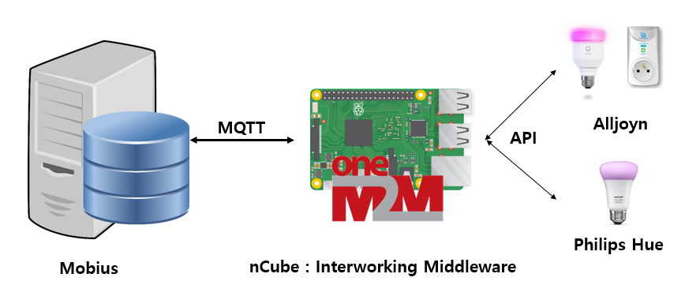
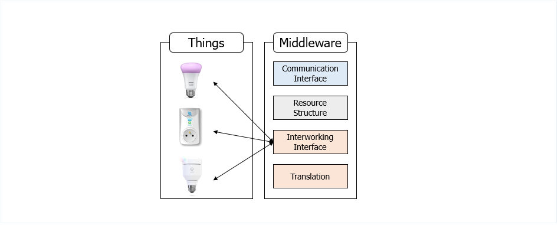
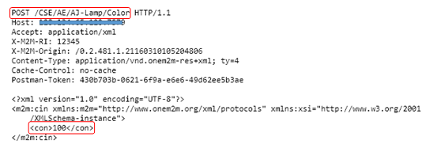

# nCube-Interworking-Middleware

## Introduction
The nCube-Interworking-Middleware project is software for middleware within IoT service platform. The purpose of this project is to provide M2M (Machine-to-Machine) communication service between heterogeneous IoT platforms. It is working base on oneM2M MQTT (Message Queuing Telemetry Transport). This middleware performs device registration and control requests for Alljoyn and Philips Hue platforms. nCube-Interworking-Middleware was developed based on open source Eclipse for oneM2M middleware service. 

## Platform Structure
nCube : Interworking Middleware communicates with Mobius using specific Forwarding Topic as MQTT protocol. Alljoyn products and Philips Hue devices can be controlled through the internal interlocking module implemented using the device manufacturer's API.

## Middleware Functional Modules
nCube : Interworking Middleware consists of the following four main modules. The communication interface modules communicates with Mobius using MQTT. The Resource Structure module structures the oneM2M resource for the interworked device and sends a device registration request to Mobius. The Translation module is a module that converts the HTTP request message into an MQTT message. The Interworking Interface module is implemented based on the OPEN API provided by the IoT device company, analyzes the message for each request, and controls the API of the corresponding device by controlling the API.

## Runtime Environment
Runs on Raspbian operating system based on Debian Linux.
Development environment
### jdk installation 
    sudo apt-get install oracle-java8-jdk
### Eclipse installation
    sudo apt-get install eclipse
    
## Get Started
### Eclipse
#### Eclipse Project Download
  * You can download this project here https://github.com/cclabKW/Middleware.git or 
    <pre><code>git clone https://github.com/cclabKW/Middleware.git</code></pre>
    
#### Eclipse Project Import
   * [Import] -> [General] ->[Projects from Folder or Archive] -> [Directory] -> Select the folder installed project.
   
   
### Configurations
#### Mobius
 * You can download Mobius project here http://developers.iotocean.org/archives/module/mobius.
 
 * Set MQTT Publish Topic the same as Forwarding Subscribe Topic.
 
#### Philips Hue
 * Modify the bridge IP address of line 49 of MainProcessor.java to the IP address of your bridge.
 
 * If you do not have a Philips Hue product, comment out or remove the relevant function code at MainProcessor.java.
 
 * Before starting Middleware, device must be connected to internal network to register device in Mobius Database.
 
#### Alljoyn library
 * If you do not have a Alljoyn product, comment out or remove the relevant function code at MainProcessor.java.
 
 * You can download Alljoyn library here https://gist.github.com/germanviscuso/30cfa7dfb041c12e6ba3.
 
 * Supports Java7-jdk or higher version.
 
 * Before starting Middleware, Alljoyn devices have to connect to network through the onboarding application.

## Simple Test
Run this project and connect to the Mobius server, check the resource structure through resource monitoring or Postman, and send a control request to that path.

ex) your_CSE_name / your_AE_name / AJ-Lamp / Brightness or your_CSE_name / your_AE_name / Hue-Lamp / Color

You can send a CIN create request message referring to the table below.

   |  | Brightness | Color
   |--------- | --------- | ---------
   |Alljoyn LIFX | on/off & 1-100 | 1-100
   |Philips Hue | on/off & 1-100 | 1-100

ex) HTTP Request Message 

## Interworking Other device

Refer to the Interworking Interface Module to create an API call function.

